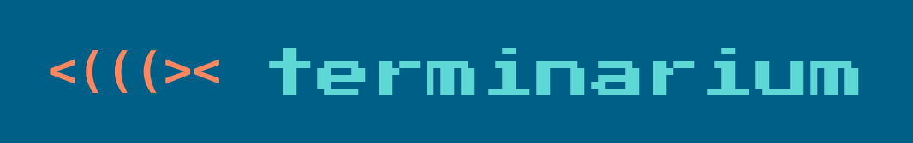
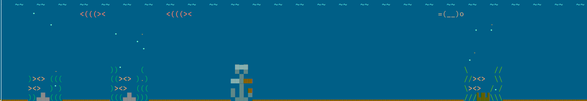
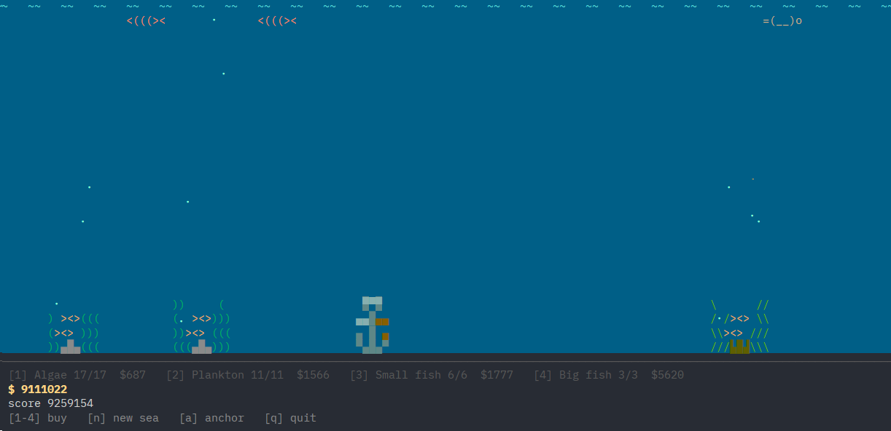

<p align="center">
  
</p>

<p align="center">
  <em>A tiny sea that lives in a terminal pane and grows while your coding agent works.</em>
</p>

<p align="center">
  <a href="LICENSE-MIT"></a>
</p>

<p align="center">
  <a href="#install">Install</a> &bull;
  <a href="#how-to-play">How to play</a> &bull;
  <a href="#terminal-setup">Terminal setup</a> &bull;
  <a href="#development">Development</a> &bull;
  <a href="#release-history">Release history</a> &bull;
  <a href="#license">License</a>
</p>

<p align="center">
  <b>English</b> &bull; <a href="README.ja.md">日本語</a>
</p>

<!-- Lead capture: the wallpaper layer in a slim pane, daytime palette.
     A dusk/night variant can later serve dark-theme readers via <picture>. -->
<p align="center">
  
</p>

Somewhere in your terminal mosaic, one pane is a quiet sea. It asks nothing
while you work — no numbers, no bars — and it keeps growing while you are
away. And the sea is yours to build: under the calm surface runs a real
incremental economy, and widening the pane opens it.

## Install

One command, prebuilt binary, no toolchain — installs to `~/.local/bin` in
seconds:

```sh
curl -fsSL https://github.com/khaym/terminarium/releases/latest/download/terminarium-installer.sh | sh
```

Windows (PowerShell):

```powershell
powershell -ExecutionPolicy Bypass -c "irm https://github.com/khaym/terminarium/releases/latest/download/terminarium-installer.ps1 | iex"
```

The installer picks the binary for your platform (Linux glibc/musl, macOS,
Windows) from GitHub Releases and verifies its checksum. It is an ordinary
release asset — read it before you run it, if you like.

Then:

```sh
terminarium
```

(Building from source instead: `git clone` this repository and
`cargo install --path .` — then run it the same way.)

Uninstalling is just as small: remove `~/.local/bin/terminarium`, and
`~/.local/share/terminarium/` if you don't want to keep your sea.

## How to play

The window size is the interface. One binary, two layers:

- **Wallpaper** — any pane smaller than 80×20: just the sea. No numbers, no
  input; the thing you glance at between prompts.
- **Game** — 80×20 or larger: the same sea plus the economy — your currency,
  prices, and the reef.

<!-- The game layer at full width, placed here so the two-layer claim is
     shown, not told. -->
<p align="center">
  
</p>

Start in a wide pane: place your reef, press `s` to start the sea, buy your
first algae, then shrink the pane and get back to work. Each tier of life
feeds on the one below; the surplus settles as detritus — your currency.

Placing the reef (until `s`):

| Key | Action |
|---|---|
| `h` `l` (or `←` `→`) | move along the sea floor |
| `j` `k` (or `↑` `↓`) | pick a rock to place |
| `Enter` / `Backspace` | drop / lift a rock |
| `s` | commit the reef and start the sea |

During the run:

| Key | Action |
|---|---|
| `1`–`4` | buy life: algae → plankton → small fish → big fish |
| `a` | grab the sunken anchor — a landmark your sea earns as it grows (`h` `l` move it, `Enter` sets it) |
| `n`, then `y` | start a new sea (prestige) |

`q` (or `Ctrl-C`) quits, in either layer, at any time.

Widening the pane again collects everything that accumulated while you worked
— that moment is the game's heartbeat. Buy something (or don't), shrink, work.

Quitting loses nothing: the ecosystem keeps producing while the process is
closed, and the next launch settles the difference (offline progress).

## Terminal setup

**tmux — enable RGB color.** Default tmux quantizes colors to 256. The palette
is designed to survive that, but the water looks best in full color. In
`~/.tmux.conf`:

```
set -ga terminal-features ',*:RGB'
```

**Containers — set your timezone.** The palette follows the system clock
through dawn, noon, dusk, and night. Containers (devcontainers, Codespaces)
default to UTC, which shifts the cycle — a noon sea at 11 pm. Set `TZ` to
your zone (e.g. `TZ=Asia/Tokyo`) in the container's environment.

## Development

```sh
cargo test   # economy invariants + rendering tests
cargo run    # run from source
```

The economy is deterministic and readable in the tests: its rules live in
`tests/invariants.rs`, both rendering layers in `tests/render.rs`.

## Release history

- **v0.3.0** — A fifth and a sixth reef. The lantern: moss and noctiluca glow
  around an anglerfish's lit lure, past the budget-5 wall (score 100,000). The
  lagoon: jellyfish pulse and drift over the seagrass under a gliding turtle —
  the first life in the tank that moves vertically (score 60,000).
- **v0.2.0** — A fourth reef, the grotto: shrimp crowd its cave mouth under a
  gliding squid. Unlocks at score 40,000.
- **v0.1.0** — First release: the two-layer sea, the economy, three reefs, the
  whale and the anchor.

## License

Licensed under either of [MIT](LICENSE-MIT) or
[Apache-2.0](LICENSE-APACHE), at your option.
